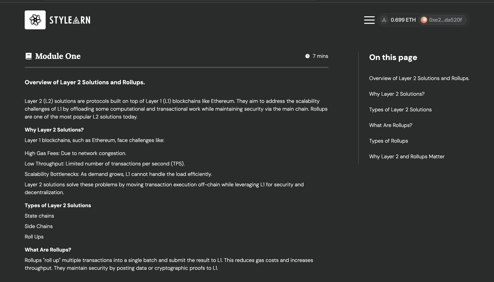

# StyLearn: Your Gateway to Stylus and Arbitrum Mastery

Stylearn is an interactive and user-friendly platform designed to provide both beginners exploring Web3 concepts and developers building with Arbitrum Stylus a comprehensive learning experience. It offers high-level overviews for non-technical users and in-depth resources for developers using Rust, C and C++, with an engaging reward system that includes points and NFTs as tokens of achievement. StyLearn offers hands-on learning, real-time coding challenges, and community engagement to help you thrive in Web3.

## Screenshots

## Features

- Interactive Tutorials
Learn Stylus through step-by-step guides, quizzes, and practical coding challenges designed to solidify your understanding.

- Real-Time Code Editor
Practice coding directly in your browser with our built-in editor. Run, debug, and test your Stylus scripts seamlessly.

- Curated Resources
Access the latest documentation, tools, and best practices to stay updated in the Arbitrum ecosystem.

- Gamified Learning
Earn badges and certificates in form of NFTs to showcase your achievements and share them with potential employers or your network.

## Tech Stack

- Frontend: React + Tailwind CSS
- Backend: Node.js + Express.js
- Blockchain Integration: Ethers, Reown
- Network: Arbitrum One and Arbitrum Sepolia
- Smart Contract: Solidity/Rust/Stylus
- Code Editor: Monaco Editor

## Links

- [Design](https://www.figma.com/design/e0revywkRMOA5sjPyShMmQ/StyLearn?node-id=0-1&t=vcyHEhsirHEvOc5n-1)
- [Live Deployment](https://sty-learn.vercel.app/)
- [Github](https://github.com/Sty-Learn)

## Join the Community

Stay connected and be part of the StyLearn community:

- [Twitter](https://x.com/Sylus_Learn)
- [Telegram](https://t.me/Stylus_Learn)
- [Discord](https://discord.gg/TcF7FWdW)

## Team Members

- Esther Aladi(Product/Community Manager)
- Oluwakemi Atoyebi(Frontend Developer)
- Mayowa Abikoye(Smart Contract and Backend Developer)